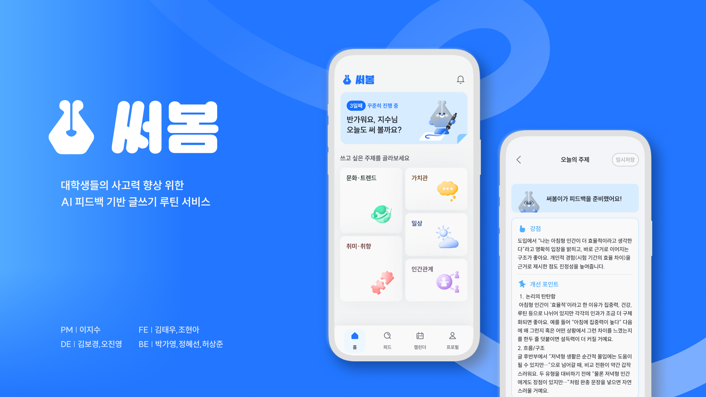
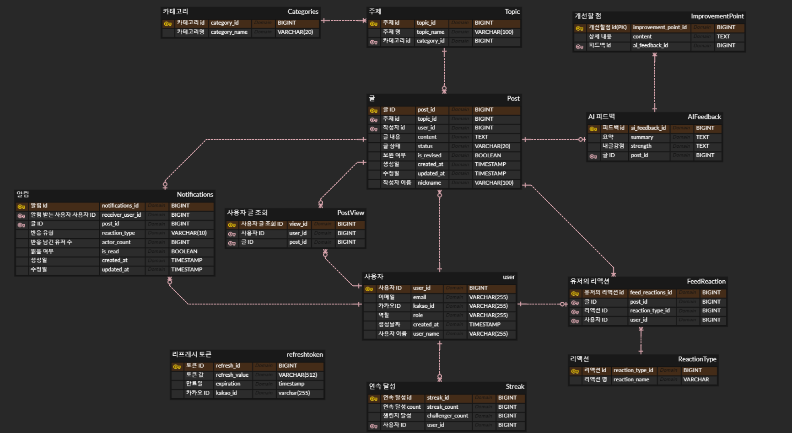

# 써봄 : 나의 언어를 지키는 루틴

AI 시대에 나만의 언어와 사고력을 키울 수 있는 글쓰기 루틴 서비스입니다.      
매일 원하는 주제를 골라 한 편의 글을 쓰고 AI 코치의 피드백을 통해 나의 글을 더욱 발전시켜 갈 수 있습니다.

## URL
https://www.seobom.site

## 프로젝트 소개
기간: 2025.10.04 ~ 2025.11.28(8주)     
팀원: PM(1), PD(2), FE(2), BE(3)

|FE |FE|                                      BE                                       |BE|BE|
|:-------:| :-----: |:-----------------------------------------------------------------------------:| :-----: | :-----: |
|  |  |  |  |  |
| [태우](https://github.com/kim3360) | [현아](https://github.com/hyeon-aa) |                      [혜선](https://github.com/chunghye98)                      | [상준](https://github.com/im0x00) | [가영](https://github.com/pgy8404) |

## 핵심 기능
1. **사고력 훈련 기반 글쓰기**    
   논리적 사고와 확장적 사고 주제를 구분해 총 5개 선택지를 제공
2. **AI 피드백**  
   글의 완성도를 평가하고, 글의 논리·표현·구조에 대한 피드백 제시
3. **피드**   
   독자의 존재인식과 생각을 공유하며 사고를 확장
4. **캘린더**  
   기록이 채워지는 캘린더를 통해 성취감 제공
5. **카카오 로그인** 
   쉬운 회원가입/로그인 기능 제공
6. **알림**   
   독자가 남긴 반응을 알림으로 받아 성취감 제고

## Tech Stack
### Backend
- **Language & Framework**: `Java 17`, `Spring Boot 3.5.7`
- **Data Access**: `Spring Data JPA`, `Querydsl`
- **Security**: `Spring Security`, `OAuth2 Client`, `JWT`

### Database
- `PostgreSQL`

### External API
- `Naver Clova Studio API` - AI 피드백 생성

### Infrastructure & DevOps
- **Cloud**: `NCP Server`, `Supabase`
- **CI/CD**: `Docker`, `Jenkins`

### Documentation
- `Swagger/OpenAPI 3.0`

## 프로젝트 구조
### ERD

### Project Architecture

## 회고 및 고민한 점
추가 예정